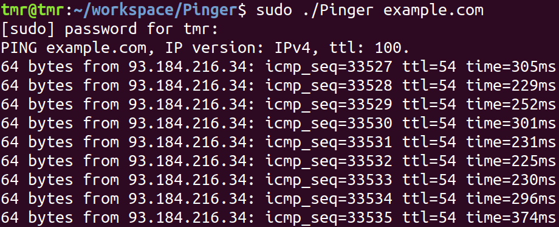
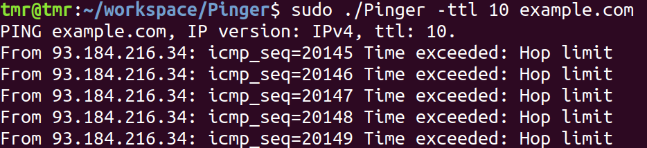

# Pinger CLI Application

## Short description
This is a pinger application, which can ping IPv4 addresses and has limited support for IPv6. Additionally, you can set TTL (Time to Live) (Please, refer to [options](#options)).

## Usage
1. Install Golang in any way you like.
2. Install Git.
3. Clone this repository.
4. `cd` into repository.
5. Run `go build`.
6. Run `sudo ./binary_name -t 70 example.com`

### Synopsis
- `sudo ./binary_name [options] destination`
- `destination` can be hostname or literal IPv4/IPv6 address

### Options
- -t **ttl** Set the IP Time to Live.
- -6 Set the IP version to IPv6.
NOTE: You do not need to set this option, if you provide literal IPv6 address.
NOTE: As I only have Link-Local IPv6 address, I had hard times getting a public one. So even though I implemented IPv6 functionality, I couldn't test it. Thus, it may not work.

## Example Screenshots

## Technical details
- This app uses privileged sockets for simplicity, thus the use of `sudo` is needed.
- The pinger is based on *stop-and-wait* principle. This means, we send the ICMP echo request and then wait for echo reply before sending another message. This approach helps to simply reason about the behaviour and adds possibility of representing the pinger as the state machine.